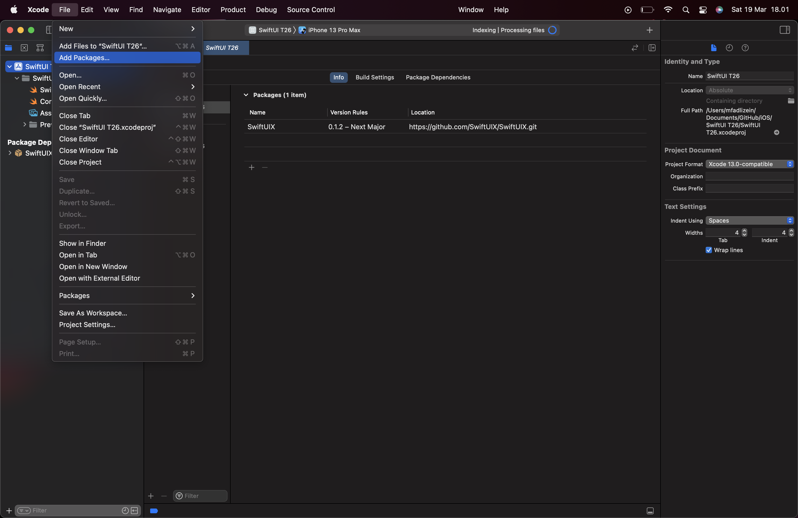
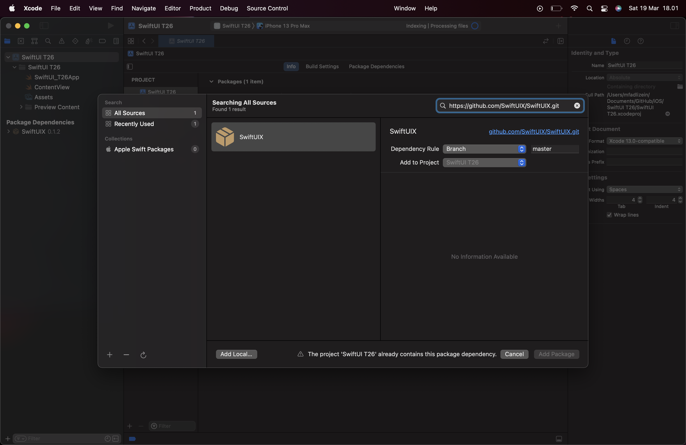
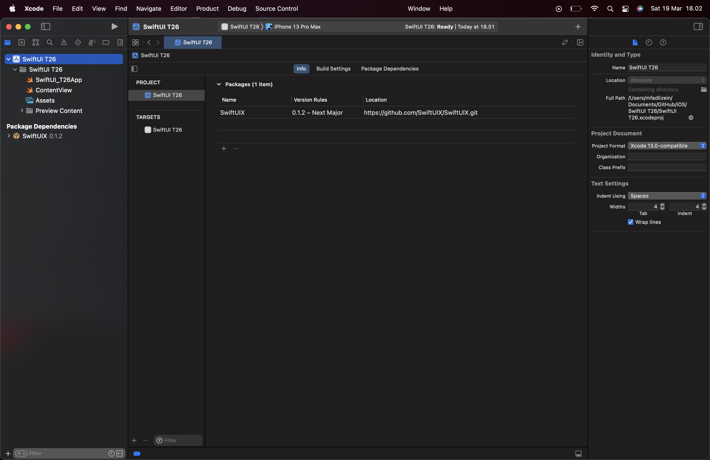
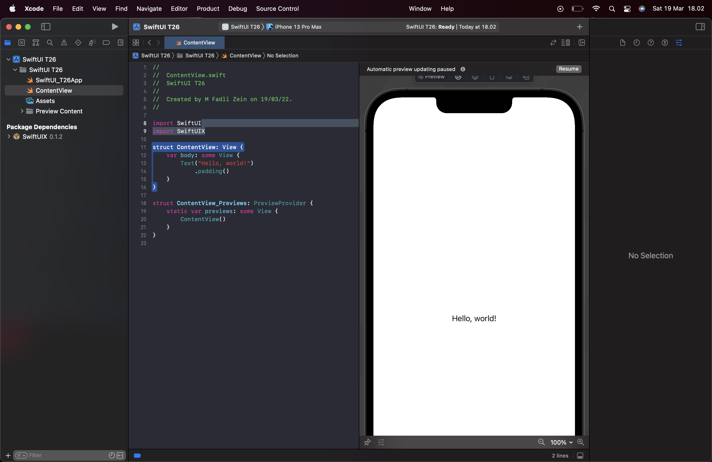
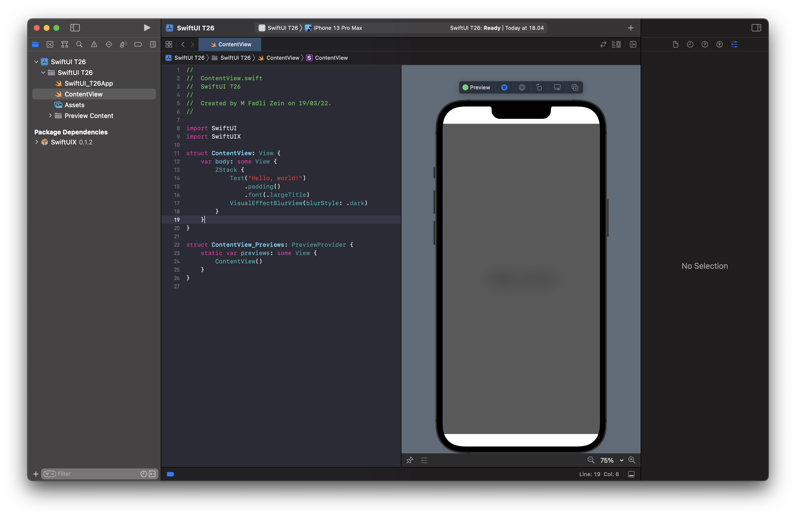

# SwiftUI-T26

[Source](https://designcode.io/swiftui-handbook-package-manager)

[SwiftUIX](https://github.com/SwiftUIX/SwiftUIX)

[SDWebImageSwiftUI](https://github.com/SDWebImage/SDWebImageSwiftUI)

[Ink](https://github.com/JohnSundell/Ink)

[trackable-scroll-view](https://github.com/maxnatchanon/trackable-scroll-view)

[contentful.swift](https://github.com/contentful/contentful.swift)

[firebase-ios-sdk](https://github.com/firebase/firebase-ios-sdk)

[apollo-ios](https://github.com/apollographql/apollo-ios)

<pre>





</pre>

---

```
Copyright 2022 M. Fadli Zein
```

